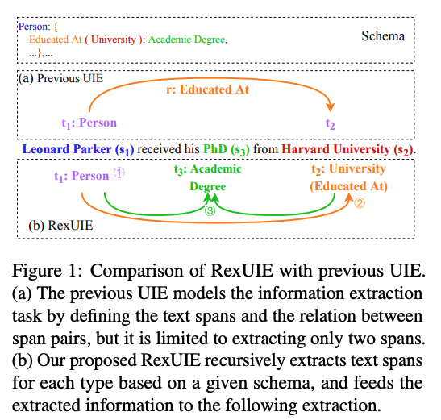
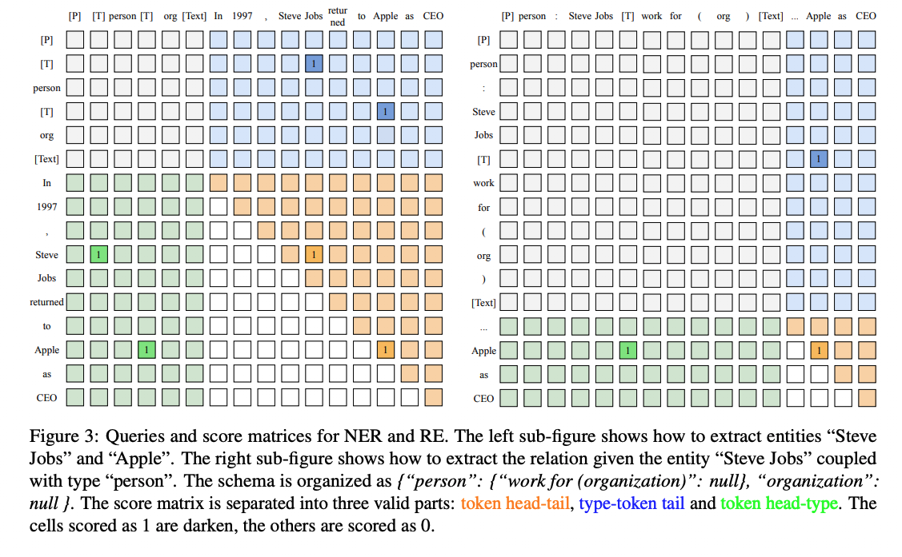
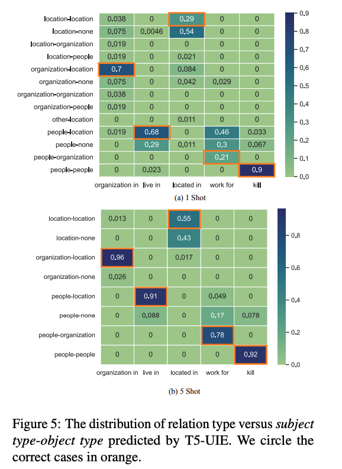
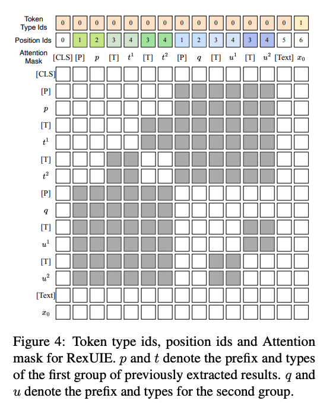
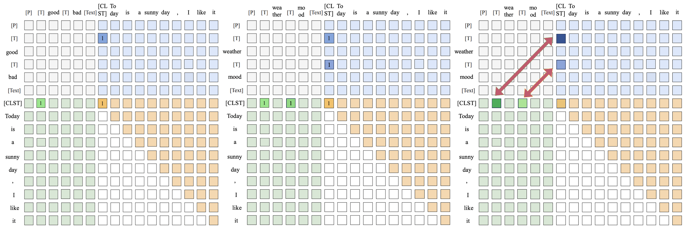

---
tasks:
- rex-uninlu
- siamese-uie
- text-classification
- zero-shot-classification
- question-answering
- sentiment-classification
- sentence-similarity
- nli
- token-classification
- named-entity-recognition
- relation-extraction
- universal-information-extraction
model_type:
- bert
domain:
- nlp
frameworks:
- pytorch
backbone:
- transformer
metrics:
- accuracy
license: Apache License 2.0
language: 
- cn
tags:
- 通用信息抽取
- 零样本信息抽取
- 命名实体识别
- 关系抽取
- 事件抽取
- 属性情感抽取
- 指代消解
- 文本分类
- 情感分类
- 自然语言推理
- 机器阅读理解
- 零样本分类
- transformer
- AliceMind
- Alibaba
datasets:
  test:
  - damo/people_daily_ner_1998_tiny
  - damo/absa_aoe
widgets:
  - enable: true
    version: 1
    task: rex-uninlu
    model_revision: v1.2.1
    inputs:
      - type: text #可选值：text|image|video|audio
        name: input #要跟pipeline代码中的input支持的key一致，可省略
        title: #用于前端显示，如果不填会用name来显示
        displayType: TextArea
        validator: 
          max_words: 300
    output:
      displayType: Text
      displayProps:
        arrayParser: json
      displayValueMapping: output
    inferencespec:
      cpu: 2 #CPU数量
      memory: 4000 #单位MB
      gpu: 0 #GPU数量
      gpu_memory: 16000 #单位MB
    parameters:
      - name: schema #参数名，要跟pipeline代码中的kwargs支持的key一致
        title: Schema #用于前端显示，如果不写会使用name来显示
        type: string #可选值：enum|string|int，enum需要提供values
    examples:
      - name: 1
        title: 示例1
        inputs:
          - name: input
            data: '1944年毕业于北大的名古屋铁道会长谷口清太郎等人在日本积极筹资，共筹款2.7亿日元，参加捐款的日本企业有69家。'
        parameters:
          - name: schema
            value: '{"人物": null, "地理位置": null, "组织机构": null}'
      - name: 2
        title: 示例2
        inputs:
          - name: input
            data: '很满意，音质很好，发货速度快，值得购买'
        parameters:
          - name: schema
            value: '{"属性词": {"情感词": null}}'
      - name: 3
        title: 示例3
        inputs:
          - name: input
            data: '1987年首播的央视版《红楼梦》是中央电视台和中国电视剧制作中心根据中国古典文学名著《红楼梦》摄制的一部古装连续剧'
        parameters:
          - name: schema
            value: '{"组织机构": {"注册资本(数字)": null, "创始人(人物)": null, "董事长(人物)": null, "总部地点(地理位置)": null, "代言人(人物)": null, "成立日期(时间)": null, "占地面积(数字)": null, "简称(组织机构)": null}}'
      - name: 4
        title: 示例4
        inputs:
          - name: input
            data: '7月28日，天津泰达在德比战中以0-1负于天津天海。'
        parameters:
          - name: schema
            value: '{"胜负(事件触发词)": {"时间": null, "败者": null, "胜者": null, "赛事名称": null}}'
      - name: 5
        title: 示例5
        inputs:
          - name: input
            data: '[CLASSIFY]因为周围的山水，早已是一派浑莽无际的绿色了。任何事物（候选词）一旦达到某种限度，你就不能再给它(代词)增加什么了。'
        parameters:
          - name: schema
            value: '{"下面的句子中，代词“它”指代的是“事物”吗？是的": null, "下面的句子中，代词“它”指代的是“事物”吗？不是": null}'
      - name: 6
        title: 示例6
        inputs:
          - name: input
            data: '[CLASSIFY]有点看不下去了，看作者介绍就觉得挺矫情了，文字也弱了点。后来才发现 大家对这本书评价都很低。亏了。'
        parameters:
          - name: schema
            value: '{"正向情感": null, "负向情感": null}'
      - name: 7
        title: 示例7
        inputs:
          - name: input
            data: '[CLASSIFY]学校召开2018届升学及出国深造毕业生座谈会就业指导'
        parameters:
          - name: schema
            value: '{"民生": null, "文化": null, "娱乐": null, "体育": null, "财经": null, "教育": null}'
      - name: 8
        title: 示例8
        inputs:
          - name: input
            data: '[MULTICLASSIFY]《格林童话》是德国民间故事集。由德国的雅各格林和威廉格林兄弟根据民间口述材料改写而成。其中的《灰姑娘》、《白雪公主》、《小红帽》、《青蛙王子》等童话故事，已被译成多种文字，在世界各国广为流传，成为各地收集民间故事的范例。'
        parameters:
          - name: schema
            value: '{"民间故事": null, "推理": null, "心理学": null, "历史": null, "传记": null, "外国名著": null, "文化": null, "诗歌": null, "童话": null, "艺术": null, "科幻": null, "小说": null}'
      - name: 9
        title: 示例9
        inputs:
          - name: input
            data: '[CLASSIFY]雨刷刮不干净怎么办'
        parameters:
          - name: schema
            value: '{"APP系统功能": {"蓝牙钥匙故障": null, "界面显示异常": null, "数据显示不准确": null, "远程控制故障": null}, "电器-附件": {"电子模块问题": null, "雨刮、洗涤器故障": null, "防盗报警系统": null, "定速巡航系统": null}}'
---

在去年年底，我们团队根据开源模型DuUIE推理性能不足的问题，提出了一套基于[SiamesePrompt](https://modelscope.cn/models/damo/nlp_structbert_siamese-uninlu_chinese-base/summary)的通用自然语言理解框架，在速度提升30%的同时，F1 Score提升了25%，同时可以支持任意元组数量的抽取。

然而，当我们深入思考DuUIE和SiamesPrompt后，这两套框架都有同一个问题：由于需要逐个遍历每个schema，计算复杂度和Schema的复杂度成正比。显然，当一个任务的schema比较复杂时，这个计算成本就显得不太可接受了。为了解决这个问题，我们提出了RexPrompt通用自然语言理解框架。经过实验，我们发现**RexPrompt的推理速度是SiamesePrompt框架的3倍，同时F1 Score又提升了10%！**

同时，这个工作提出了一套真正的UIE框架，并探讨了小模型在低资源IE下的表现，同时我们也将该框架拓展到了多模态（mRex）、通用自然语言理解（RexUniNLU）等多个领域，探索了多模态、多语言、多任务的所有自然语言理解问题，希望可以给读者们带来一些在大模型时代，如何做小模型的insight。

很高兴这个工作也在EMNLP2023被录用：[《RexUIE: A Recursive Method with Explicit Schema Instructor for Universal Information Extraction》](https://arxiv.org/abs/2304.14770)

# 模型描述

## 如何实现RexPrompt
RexPrompt框架的中文解释是“一种基于显式图式指导器的递归方法”，在这个框架中，我们将schema处的prompt进行了并行处理，同时利用了prompts isolation的方式，缓解了schema顺序对于抽取效果的影响，同时由于递归方式的存在，RexPrompt和SiamesePrompt一样可以实现任意元组的抽取。

### 重新定义UIE
我们在SiamesePrompt的那个工作中，其实就提到过现在的一些工作对UIE的定义其实是有失偏颇的，基本上只能支持Single Span Extraction和Span Pair Extraction，其他的包含3个及以上span的抽取任务，他们就支持不了了。不过，之前的定义比较口语化，我们在RexUIE这篇工作中，形式化地重新定义了UIE任务。


如上图所示，$C^n$为深度为$n$的树状schema集合，$s$为span，$t$为span的类型，$x$为输入文本。UIE的本质是基于输入文本$x$和树状Schema $C^n$抽取出若干长度为$n$的$（s，t）$序列。这样的统一形式化定义，包含NER、RE、COQE等任意元组的信息抽取任务，因此，我们认为这才是真正的UIE。

将这个公式进一步分解到最后，我们可以发现，UIE任务的本质就是基于$C^n$、$x$以及$(s,t)_{\lt i}$，预测$(s,t)_{i}$的过程。

### RexPrompt框架



按照我们对UIE的新的定义，和之前的UIE模型的对比如上图，重新定义的UIE可以抽取复杂的关系结构，而非只能是关系三元组。

为了实现真正的UIE，我们采取了一种递归的方案，已知$(s,t)_{\lt i}$的情况下，我们将$t_{\lt i}$在$C^n$中对应的下一层$t$集合并行拼接，和$(s,t)_{\lt i}$对应的prompt $p_i$，以及输入文本，一起输入到Encoder中，通过Token Linking实现$t_i$和$s_i$的抽取和配对，以下是关系抽取的一个Token Linking的示意图。



将分数矩阵称为Z，而$\tilde{Z} = \mathbb{I}[Z \ge \delta]$，其中$\delta$是一个超参数阈值，token链接如下：

- “token head—tail”链接：用于标识属于同一个Span的token，当$i \le j$且$\tilde{Z^{i,j}} = 1$时，就被表示为一个Span。如图中的“Steve”和“Jobs”中存在一个链接，这表明“Steve Jobs”是一个Span实体；“Apple”和“Apple”自身存在一个链接，这表明“Apple”也是一个Span实体。
- “token head—type”链接：用于标识Span的头部和Span的类型，Span的起始token与其对应类型前插入的特殊token[T]相链接。如图中的“Steve Jobs”的首个token“Steve”与其类型“person”前的特殊token存在一个链接，表明“Steve Jobs”是一个人物实体。
- “type—token tail”链接：用于标识Span的尾部和Span的类型，Span的最后一个token与其对应类型前插入的特殊token [T]相链接。如图中的“Steve Jobs”的最后一个token “Jobs”与其类型“person”前的特殊token存在一个链接，同样表明“Steve Jobs”是一个人物实体。

综上所述，对于一组token $\langle i, j \rangle$，若存在$Z^{i,j} \ge \delta$，且存在一个类型[T]k，满足$Z^{i,k} \ge \delta$和$Z^{k,j} \ge \delta$，则由 $\langle i, j \rangle$ 组成的Span 的类型可以确定为$k$。


基于递归方法的抽取框架如图所示，每次查询由显式模式提示符（ESI）和文本组成，编码器将查询句子进行编码，并计算文本之间和文本与提示符的类型之间的对应分数，形成分数矩阵，从而通过token链接抽取出本次查询的结果，并且构建下一次查询文本。为了增强效果，RexPrompt结构加入了Prompt Isolation 模块，以提高模型的抽取稳定性。

### Explicit Schema Instructor
之前的UIE工作（UIE-T5、USM）都采用了Implicit Schema Instructor（ISI），ISI在表示schema信息时，并不会明确地指出Schema之间的映射关系（比如主语类型和关系类型的映射关系），这种方式的缺点是在低资源的情况下，模型会抽取出大量非法Schema的元组，如下图所示。



我们的方案通过结合递归算法，实现了Explicit Schema Instructor，从而使得模型即使在低资源的情况下，也绝对不会抽取到非法的schema元组。

### Prompt Isolation
为节约计算成本，RexUIE可以通过一次查询处理多个不同的前缀，但此时查询的隐藏表示会受到不同前缀、不同类型的干扰。例如在处理ESI查询：[CLS][P]person:Kennedy[T]kill(person)[T]live in (location)...[P]person:Lee Harvey Oswald[T]kill (person)[T]live in (location)....时，“Kennedy”和“Lee Harvey Oswald”属于不同前缀，它们的隐藏表示应当保持独立。

为解决这一问题，如下图所示，通过修改位置编码、类型编码以及注意力掩码，可以有效阻断不同令牌之间的信息交互，清晰地划分ESI中不同的部分，使得每个类型令牌只能与其自身、相应的前缀和文本进行信息交互。



# 期望模型使用方式以及适用范围

## 安装modelscope
```bash
pip install modelscope
```

## 零样本推理示例
```python
from modelscope.pipelines import pipeline
from modelscope.utils.constant import Tasks

semantic_cls = pipeline('rex-uninlu', model='damo/nlp_deberta_rex-uninlu_chinese-base', model_revision='v1.2.1')

# 命名实体识别 {实体类型: None}
semantic_cls(
    input='1944年毕业于北大的名古屋铁道会长谷口清太郎等人在日本积极筹资，共筹款2.7亿日元，参加捐款的日本企业有69家。', 
    schema={
        '人物': None,
        '地理位置': None,
        '组织机构': None
    }
) 
# 关系抽取 {主语实体类型: {关系(宾语实体类型): None}}
semantic_cls(
  input='1987年首播的央视版《红楼梦》是中央电视台和中国电视剧制作中心根据中国古典文学名著《红楼梦》摄制的一部古装连续剧', 
    schema={
        '组织机构': {
            '注册资本(数字)': None,
            '创始人(人物)': None,
            '董事长(人物)': None,
            '总部地点(地理位置)': None,
            '代言人(人物)': None,
            '成立日期(时间)': None, 
            '占地面积(数字)': None, 
            '简称(组织机构)': None
        }
    }
) 

# 事件抽取 {事件类型（事件触发词）: {参数类型: None}}
semantic_cls(
  input='7月28日，天津泰达在德比战中以0-1负于天津天海。', 
    schema={
        '胜负(事件触发词)': {
            '时间': None,
            '败者': None,
            '胜者': None,
            '赛事名称': None
        }
    }
) 

# 属性情感抽取 {属性词: {情感词: None}}
semantic_cls(
  input='很满意，音质很好，发货速度快，值得购买', 
    schema={
        '属性词': {
            '情感词': None,
        }
    }
) 

# 允许属性词缺省，#表示缺省
semantic_cls(
  input='#很满意，音质很好，发货速度快，值得购买', 
    schema={
        '属性词': {
            '情感词': None,
        }
    }
) 

# 支持情感分类
semantic_cls(
  input='很满意，音质很好，发货速度快，值得购买', 
    schema={
        '属性词': {
            "正向情感(情感词)": None, 
            "负向情感(情感词)": None, 
            "中性情感(情感词)": None
        }
    }
) 

# 指代消解，正文前添加[CLASSIFY]，schema按照“自行设计的prompt+候选标签”的形式构造
semantic_cls(
  input='[CLASSIFY]因为周围的山水，早已是一派浑莽无际的绿色了。任何事物（候选词）一旦达到某种限度，你就不能再给它(代词)增加什么了。',
    schema={
        '下面的句子中，代词“它”指代的是“事物”吗？是的': None, "下面的句子中，代词“它”指代的是“事物”吗？不是": None,
        }
) 

# 情感分类，正文前添加[CLASSIFY]，schema列举期望抽取的候选“情感倾向标签”；同时也支持情绪分类任务，换成相应情绪标签即可，e.g. "无情绪,积极,愤怒,悲伤,恐惧,惊奇"
semantic_cls(
  input='[CLASSIFY]有点看不下去了，看作者介绍就觉得挺矫情了，文字也弱了点。后来才发现 大家对这本书评价都很低。亏了。', 
    schema={
        '正向情感': None, "负向情感": None
        }
)


# 单标签文本分类，正文前添加[CLASSIFY]，schema列举期望抽取的候选“文本分类标签”
semantic_cls(
  input='[CLASSIFY]学校召开2018届升学及出国深造毕业生座谈会就业指导', 
    schema={
        '民生': None, '文化': None, '娱乐': None, '体育': None, '财经': None, '教育': None
        }
)

# 多标签文本分类，正文前添加[MULTICLASSIFY]，schema列举期望抽取的候选“文本分类标签”
semantic_cls(
  input='[MULTICLASSIFY]《格林童话》是德国民间故事集。由德国的雅各格林和威廉格林兄弟根据民间口述材料改写而成。其中的《灰姑娘》、《白雪公主》、《小红帽》、《青蛙王子》等童话故事，已被译成多种文字，在世界各国广为流传，成为各地收集民间故事的范例。', 
    schema={
        '民间故事': None, '推理': None, '心理学': None, '历史': None, '传记': None, '外国名著': None, '文化': None, '诗歌': None, '童话': None, '艺术': None, '科幻': None, '小说': None
        }
)

# 层次分类，正文前添加[CLASSIFY]或者[MULTICLASSIFY]（多标签层次分类），schema按照标签层级构造 {层级1标签: {层级2标签: None}}
semantic_cls(
  input='[CLASSIFY]雨刷刮不干净怎么办', 
    schema={
        'APP系统功能': {'蓝牙钥匙故障': None, '界面显示异常': None, '数据显示不准确': None, '远程控制故障': None}, 
        '电器-附件': {'电子模块问题': None, '雨刮、洗涤器故障': None, '防盗报警系统': None, '定速巡航系统': None}
    }
)

# 文本匹配，正文前添加[CLASSIFY]，待匹配段落按照“段落1：段落1文本；段落2：段落2文本”，schema按照“文本匹配prompt+候选标签”的形式构造
semantic_cls(
  input='[CLASSIFY]段落1：高分子材料与工程排名；段落2：高分子材料与工程专业的完整定义', 
    schema={
        '文本匹配：相似': None, '文本匹配：不相似': None
        }
)

# 自然语言推理，正文前添加[CLASSIFY]，待匹配段落按照“段落1：段落1文本；段落2：段落2文本”，schema按照“自然语言推理prompt+候选标签”的形式构造
semantic_cls(
  input='[CLASSIFY]段落1：呃,银行听说都要扣一点这个转手费；段落2：从未有银行扣过手续费', 
    schema={
        '段落2和段落1的关系是：蕴含': None, '段落2和段落1的关系是：矛盾': None, '段落2和段落1的关系是：中立': None
        }
)

# 选择类阅读理解，正文前添加[CLASSIFY]，schema按照“问题+候选选项”的形式构造
semantic_cls(
  input='[CLASSIFY]A：最近飞机票打折挺多的，你还是坐飞机去吧。B：反正又不是时间来不及，飞机再便宜我也不坐，我一听坐飞机就头晕。', 
    schema={
        'B为什么不坐飞机?飞机票太贵': None, 'B为什么不坐飞机?时间来不及': None, 'B为什么不坐飞机?坐飞机头晕': None, 'B为什么不坐飞机?飞机票太便宜': None,
        }
)

# 抽取类阅读理解
semantic_cls(
  input='大莱龙铁路位于山东省北部环渤海地区，西起位于益羊铁路的潍坊大家洼车站，向东经海化、寿光、寒亭、昌邑、平度、莱州、招远、终到龙口，连接山东半岛羊角沟、潍坊、莱州、龙口四个港口，全长175公里，工程建设概算总投资11.42亿元。铁路西与德大铁路、黄大铁路在大家洼站接轨，东与龙烟铁路相连。大莱龙铁路于1997年11月批复立项，2002年12月28日全线铺通，2005年6月建成试运营，是横贯山东省北部的铁路干线德龙烟铁路的重要组成部分，构成山东省北部沿海通道，并成为环渤海铁路网的南部干线。铁路沿线设有大家洼站、寒亭站、昌邑北站、海天站、平度北站、沙河站、莱州站、朱桥站、招远站、龙口西站、龙口北站、龙口港站。', 
    schema={
        '大莱龙铁路位于哪里？': None
        }
)
```
## 微调

### 下载RexPrompt代码及ckpt
```bash
 git lfs install
 git clone https://www.modelscope.cn/damo/nlp_deberta_rex-uninlu_chinese-base.git
 cd nlp_deberta_rex-uninlu_chinese-base
```

### FineTune
数据示例在`rex/data`中，`config.ini`中是训练的参数配置，`scripts/finetune.sh`是微调的脚本
```bash
cd rex
pip install -r reqs.txt
. config.ini && bash scripts/finetune.sh
```

# 实验评估
基于RexPrompt框架，我们实现了RexUIE（通用信息抽取）、RexUniNLU（通用自然语言理解）、mRexUniNLU（多模态通用自然语言理解）三套模型，统一了多模态场景下的所有理解类任务。在这里，我们仅分享中文RexUniNLU-base模型的效果。

## 中文RexUniNLU-base
先前的SiameseUniNLU模型虽然可以同时处理抽取类任务和分类任务，但在分类任务上仍然有三个不足：
1. 由于所采取的抽取框架，而抽取模型的结果依赖于所输出的得分向量与预设阈值之间的大小判断，因此有一定概率使得模型并不会返回分类标签
2. 由于采用了将标签拼接到正文前面的方式，正文和标签会共享模型最大512的输入文本长度，因此当分类标签数量非常多的时候，正文就会被截断，从而影响到模型的分类效果
3. 直接拼接方式意味着无法表示复杂的层次结构，因此SiameseUniNLU无法处理层次分类任务

基于此，我们在Rex框架的基础上，进一步设计了两种特殊的分类token [CLASSIFY]和[MULTICLASSIFY]，作为填充到正文开头的标记。其中[CLASSIFY]用于单标签分类任务，[MULTICLASSIFY]用于多标签分类任务。这样做一方面显示地告诉模型当前任务类别为分类任务，另一方面便于建立正文部分内容（在分类任务中仅限于作为填充的分类token）和分类标签之间的联系。

对于输出的得分矩阵，我们同样会运用到抽取任务中的三种linking类型，即绿色的type-token-head linking，蓝色的type-token-tail linking，和黄色的token-head-tail linking。对于能直接从得分矩阵获取结果的情况，如下面左图的的单标签分类任务，由于 [CLST]指向good标签所属的标识[T]（图中值为1的部分），可以解码出该段原文“Today is a sunny day, I like it"所对应的情绪标签为“good”。类似地，对于中图的多标签分类任务，也可以解码得到“Today is a sunny day, I like it"所对应的话题包括“weather”和“mood”

然而，并不是所有得分矩阵都能建立linking关系，因此，我们提出了一种“握手机制”以应对上述的第一个问题。由于标识分类任务的token [CLASSIFY]和[MULTICLASSIFY]固定出现在正文的开头，而每一个类别标签所对应[TYPE]标识符待位置为已知信息，这样我们就可以很容易得到各个标签所对应的标识[TYPE]映射到分类token概率值，即图中“[CLST]-[T]对”的概率值（如右图加深部分所示，在矩阵中成对存在）。对于单标签分类任务，我们会返回概率信息抽取矩阵中，平均概率值最大的“[CLST]-[T]对”所对应的标签；对于多标签分类任务，我们会返回概率信息抽取矩阵中，平均概率值最大的“[CLST]-[T]对”所对应的标签，及所有平均概率值在阈值（默认0.9）以上的结果。

对于第二个问题，即类别标签非常多的情况，我们会限制前缀部分的最大长度不超过模型最大输入长度的一半，并通过两层for循环实现对所有标签和正文内容的遍历，最后再集成各部分的分类结果。

对于第三个问题，在层次分类任务中，我们采用了与n元组关系抽取类似的思路，以递归的方式实现对所有层次关系的分类。



通过在千万级数据上对模型进行训练，我们发现RexUniNLU base和large模型在包涵了实体抽取、关系抽取、事件抽取、属性情感抽取、指代消解、情感分类、文本分类、文本匹配、自然语言推理和阅读理解的10类任务17个测评数据集上（总计数十万训练及测试样本）各资源场景学习能力均显著高于前作SiameseUniNLU：


在分类任务中，这个优势更加明显：


在抽取任务中，对比RexUIE，也基本能做到base模型抽取能力损失有限，而large模型仍然具备一定优势：


# 相关论文以及引用信息

```bib
@article{Liu2023RexUIEAR,
  title={RexUIE: A Recursive Method with Explicit Schema Instructor for Universal Information Extraction},
  author={Chengyuan Liu and Fubang Zhao and Yangyang Kang and Jingyuan Zhang and Xiang Zhou and Changlong Sun and Fei Wu and Kun Kuang},
  journal={ArXiv},
  year={2023},
  volume={abs/2304.14770},
  url={https://api.semanticscholar.org/CorpusID:258417913}
}
@inproceedings{Zhao2021AdjacencyLO,
  title={Adjacency List Oriented Relational Fact Extraction via Adaptive Multi-task Learning},
  author={Fubang Zhao and Zhuoren Jiang and Yangyang Kang and Changlong Sun and Xiaozhong Liu},
  booktitle={FINDINGS},
  year={2021}
}
```
