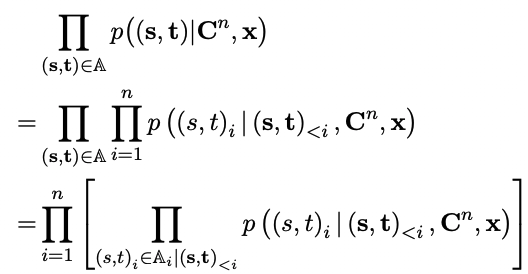
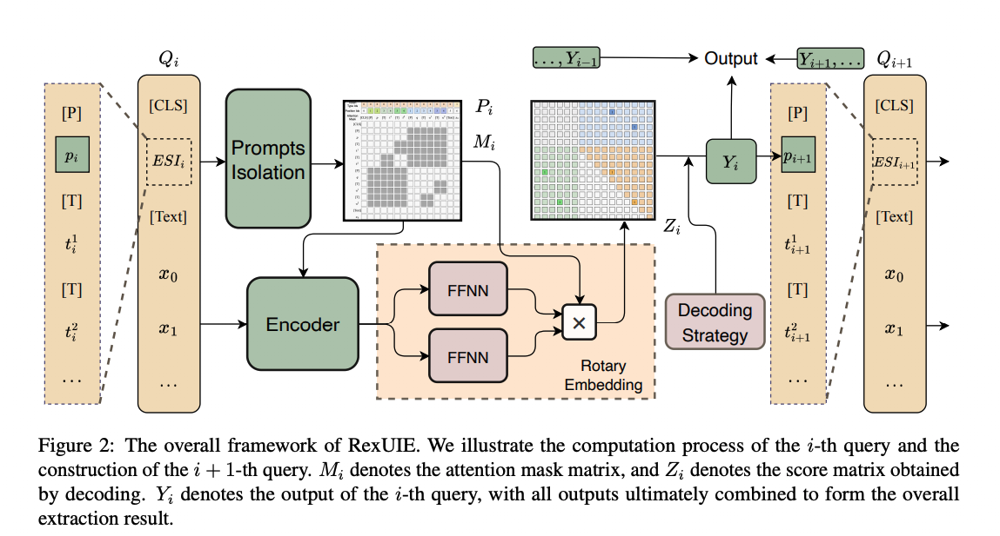
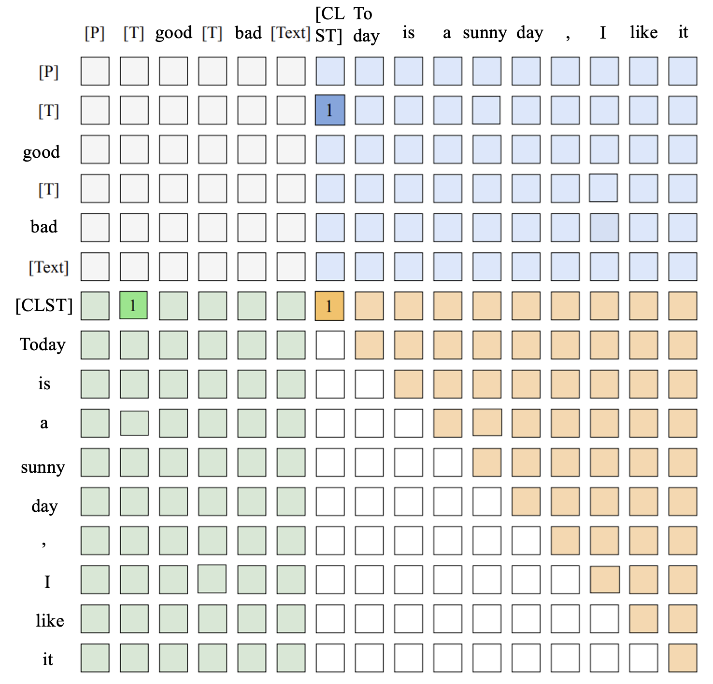
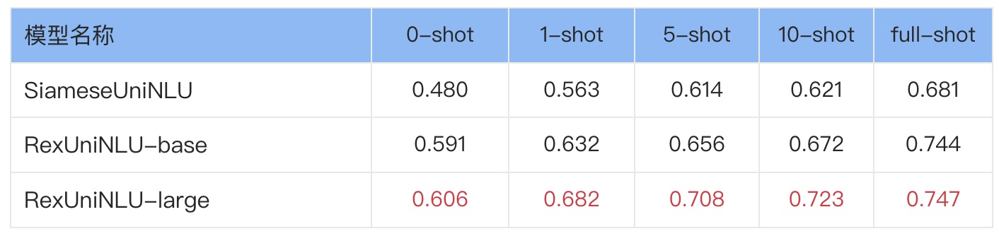
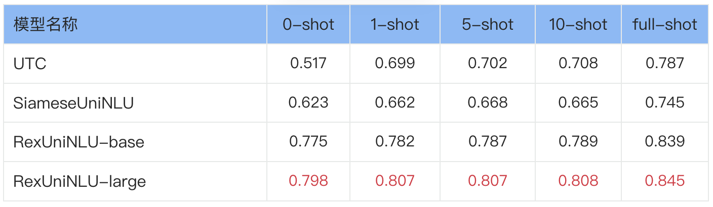
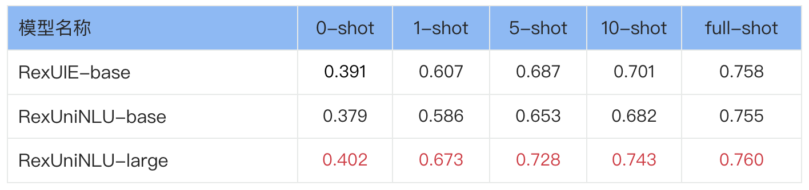

---
tasks:
- siamese-uie
- rex-uninlu
- text-classification
- zero-shot-classification
- question-answering
- sentiment-classification
- sentence-similarity
- nli
- token-classification
- named-entity-recognition
- relation-extraction
- universal-information-extraction
model_type:
- bert
domain:
- nlp
frameworks:
- pytorch
backbone:
- transformer
metrics:
- accuracy
license: Apache License 2.0
language: 
- cn
tags:
- 通用信息抽取
- 零样本信息抽取
- 命名实体识别
- 关系抽取
- 事件抽取
- 属性情感抽取
- 指代消解
- 文本分类
- 情感分类
- 自然语言推理
- 机器阅读理解
- 零样本分类
- transformer
- AliceMind
- Alibaba
datasets:
  test:
  - damo/people_daily_ner_1998_tiny
  - damo/absa_aoe
widgets:
  - task: siamese-uie
    model_revision: v1.0
    inputs:
      - type: text #可选值：text|image|video|audio
        name: input #要跟pipeline代码中的input支持的key一致，可省略
        title: #用于前端显示，如果不填会用name来显示
        validator: 
          max_words: 300 
    parameters:
      - name: schema #参数名，要跟pipeline代码中的kwargs支持的key一致
        title: Schema #用于前端显示，如果不写会使用name来显示
        type: string #可选值：enum|string|int，enum需要提供values
    examples:
      - name: 1
        title: 示例2 
        inputs:
          - name: input
            data: '1944年毕业于北大的名古屋铁道会长谷口清太郎等人在日本积极筹资，共筹款2.7亿日元，参加捐款的日本企业有69家。'
        parameters:
          - name: schema
            value: '{"人物": null, "地理位置": null, "组织机构": null}'
      - name: 2
        title: 示例1 
        inputs:
          - name: input
            data: '很满意，音质很好，发货速度快，值得购买'
        parameters:
          - name: schema
            value: '{"属性词": {"情感词": null}}'
      - name: 3
        title: 示例3
        inputs:
          - name: input
            data: '在北京冬奥会自由式中，2月8日上午，滑雪女子大跳台决赛中中国选手谷爱凌以188.25分获得金牌。2月9日上午，滑雪男子大跳台决赛中日本选手小泉次郎以188.25分获得银牌！'
        parameters:
          - name: schema
            value: '{"人物": {"比赛项目(赛事名称)": null, "参赛地点(城市)": null, "获奖时间(时间)": null, "选手国籍(国籍)": null}}'
      - name: 4
        title: 示例3
        inputs:
          - name: input
            data: '7月28日，天津泰达在德比战中以0-1负于天津天海。'
        parameters:
          - name: schema
            value: '{"胜负(事件触发词)": {"时间": null, "败者": null, "胜者": null, "赛事名称": null}}'
      - name: 5
        title: 示例5
        inputs:
          - name: input
            data: '是的,不是|哥哥点了点头。“我这几年苦哇……现在玲玲也大一点了，所以……”他望着妹妹（候选词），脸上显出一副要求她(代词)谅解的表情。'
        parameters:
          - name: schema
            value: '{"在下面的描述中，代词“她”指代的是“妹妹”吗？": null}'
      - name: 6
        title: 示例6
        inputs:
          - name: input
            data: '正向,负向|有点看不下去了，看作者介绍就觉得挺矫情了，文字也弱了点。后来才发现 大家对这本书评价都很低。亏了。'
        parameters:
          - name: schema
            value: '{"情感分类": null}'
      - name: 7
        title: 示例7
        inputs:
          - name: input
            data: '民生故事,文化,娱乐,体育,财经,房产,汽车,教育,科技,军事,旅游,国际,证券股票,农业三农,电竞游戏|学校召开2018届升学及出国深造毕业生座谈会就业指导'
        parameters:
          - name: schema
            value: '{"分类": null}'
      - name: 8
        title: 示例8
        inputs:
          - name: input
            data: '相似,不相似|摄像头区域遮挡屏幕&通话遮挡屏幕黑屏正常'
        parameters:
          - name: schema
            value: '{"文本匹配": null}'
      - name: 9
        title: 示例9
        inputs:
          - name: input
            data: '蕴含,矛盾,中立|段落1：是,但是你比如说像现在这种情况,是不是就是说咱们离它就绝对人类是再也没有任何可能性了；段落2：我对人类可能性有所思考'
        parameters:
          - name: schema
            value: '{"段落2和段落1的关系是：": null}'
      - name: 10
        title: 示例10
        inputs:
          - name: input
            data: '飞机票太贵,时间来不及,坐飞机头晕,飞机票太便宜|A：最近飞机票打折挺多的，你还是坐飞机去吧。B：反正又不是时间来不及，飞机再便宜我也不坐，我一听坐飞机就头晕。'
        parameters:
          - name: schema
            value: '{"B为什么不坐飞机?": null}'
      - name: 11
        title: 示例11
        inputs:
          - name: input
            data: '大莱龙铁路位于山东省北部环渤海地区，西起位于益羊铁路的潍坊大家洼车站，向东经海化、寿光、寒亭、昌邑、平度、莱州、招远、终到龙口，连接山东半岛羊角沟、潍坊、莱州、龙口四个港口，全长175公里，工程建设概算总投资11.42亿元。铁路西与德大铁路、黄大铁路在大家洼站接轨，东与龙烟铁路相连。大莱龙铁路于1997年11月批复立项，2002年12月28日全线铺通，2005年6月建成试运营，是横贯山东省北部的铁路干线德龙烟铁路的重要组成部分，构成山东省北部沿海通道，并成为环渤海铁路网的南部干线。铁路沿线设有大家洼站、寒亭站、昌邑北站、海天站、平度北站、沙河站、莱州站、朱桥站、招远站、龙口西站、龙口北站、龙口港站。大莱龙铁路官方网站'
        parameters:
          - name: schema
            value: '{"大莱龙铁路位于哪里？": null}'
    inferencespec:
      cpu: 2 #CPU数量
      memory: 4000 #单位MB
      gpu: 0 #GPU数量
      gpu_memory: 16000 #单位MB
---
license: Apache License 2.0
---

> 这一年大模型的工作如火如荼，越来越少的人关注小模型的发展了，但是大模型真的是万能的吗？很显然，至少目前为止，答案是否定的。这篇博客会介绍我们被EMNLP录用的一篇工作
《RexUIE: A Recursive Method with Explicit Schema Instructor for Universal Information Extraction》
。这篇工作提出了一套真正的UIE框架，并探讨了小模型在低资源IE下的表现，同时我们也将该框架拓展到了多模态（mRex）、通用自然语言理解（RexUniNLU）等多个领域，探索了多模态、多语言、多任务的所有自然语言理解问题，希望可以给读者们带来一些在大模型时代，如何做小模型的insight。

# RexPrompt通用自然语言理解框架
## RexPrompt的背景
在去年年底，我们团队根据友商开源的DuUIE性能的不足，提出了一套基于SiamesePrompt的通用自然语言理解框架，在速度提升30%的同时，F1 Score提升了25%，同时可以支持任意元组数量的抽取。

然而，当我们深入思考DuUIE和SiamesPrompt后，这两套框架都有同一个问题：由于需要逐个遍历每个schema，计算复杂度和Schema的复杂度成正比。显然，当一个任务的schema比较复杂时，这个计算成本就显得不太可接受了。为了解决这个问题，我们提出了RexPrompt通用自然语言理解框架。

经过实验，我们发现**RexPrompt的推理速度是SiamesePrompt框架的3倍，同时F1 Score又提升了10%！**

## 如何实现RexPrompt
RexPrompt框架的中文解释是“一种基于显式图式指导器的递归方法”，在这个框架中，我们将schema处的prompt进行了并行处理，同时利用了prompts isolation的方式，缓解了schema顺序对于抽取效果的影响，同时由于递归方式的存在，RexPrompt和SiamesePrompt一样可以实现任意元组的抽取。

### 重新定义UIE
我们在SiamesePrompt的那个工作中，其实就提到过现在的一些工作对UIE的定义其实是有失偏颇的，基本上只能支持Single Span Extraction和Span Pair Extraction，其他的包含3个及以上span的抽取任务，他们就支持不了了。不过，之前的定义比较口语化，我们在RexUIE这篇工作中，形式化地重新定义了UIE任务。



如上图所示，$C^n$为深度为$n$的树状schema集合，$s$为span，$t$为span的类型，$x$为输入文本。UIE的本质是基于输入文本$x$和树状Schema $C^n$抽取出若干长度为$n$的$（s，t）$序列。这样的统一形式化定义，包含NER、RE、COQE等任意元组的信息抽取任务，因此，我们认为这才是真正的UIE。

将这个公式进一步分解到最后，我们可以发现，UIE任务的本质就是基于$C^n$、$x$以及$(s,t)_{\lt i}$，预测$(s,t)_{i}$的过程。

### RexPrompt框架

按照我们对UIE的新的定义，和之前的UIE模型的对比如上图，重新定义的UIE可以抽取复杂的关系结构，而非只能是关系三元组。

为了实现真正的UIE，我们采取了一种递归的方案，已知$(s,t)_{\lt i}$的情况下，我们将$t_{\lt i}$在$C^n$中对应的下一层$t$集合并行拼接，和$(s,t)_{\lt i}$对应的prompt $p_i$，以及输入文本，一起输入到Encoder中，通过Token Linking实现$t_i$和$s_i$的抽取和配对，以下是关系抽取的一个Token Linking的示意图。

将分数矩阵称为Z，而$\tilde{Z} = \mathbb{I}[Z \ge \delta]$，其中$\delta$是一个超参数阈值，token链接如下：

- “token head—tail”链接：用于标识属于同一个Span的token，当$i \le j$且$\tilde{Z^{i,j}} = 1$时，就被表示为一个Span。如图中的“Steve”和“Jobs”中存在一个链接，这表明“Steve Jobs”是一个Span实体；“Apple”和“Apple”自身存在一个链接，这表明“Apple”也是一个Span实体。
- “token head—type”链接：用于标识Span的头部和Span的类型，Span的起始token与其对应类型前插入的特殊token[T]相链接。如图中的“Steve Jobs”的首个token“Steve”与其类型“person”前的特殊token存在一个链接，表明“Steve Jobs”是一个人物实体。
- “type—token tail”链接：用于标识Span的尾部和Span的类型，Span的最后一个token与其对应类型前插入的特殊token [T]相链接。如图中的“Steve Jobs”的最后一个token “Jobs”与其类型“person”前的特殊token存在一个链接，同样表明“Steve Jobs”是一个人物实体。

综上所述，对于一组token $\langle i, j \rangle$，若存在$Z^{i,j} \ge \delta$，且存在一个类型[T]k，满足$Z^{i,k} \ge \delta$和$Z^{k,j} \ge \delta$，则由 $\langle i, j \rangle$ 组成的Span 的类型可以确定为$k$。



基于递归方法的抽取框架如图所示，每次查询由显式模式提示符（ESI）和文本组成，编码器将查询句子进行编码，并计算文本之间和文本与提示符的类型之间的对应分数，形成分数矩阵，从而通过token链接抽取出本次查询的结果，并且构建下一次查询文本。为了增强效果，RexPrompt结构加入了Prompt Isolation 模块，以提高模型的抽取稳定性。

### Explicit Schema Instructor
之前的UIE工作（UIE-T5、USM）都采用了Implicit Schema Instructor（ISI），ISI在表示schema信息时，并不会明确地指出Schema之间的映射关系（比如主语类型和关系类型的映射关系），这种方式的缺点是在低资源的情况下，模型会抽取出大量非法Schema的元组，如下图所示。

我们的方案通过结合递归算法，实现了Explicit Schema Instructor，从而使得模型即使在低资源的情况下，也绝对不会抽取到非法的schema元组。

### Prompt Isolation
为节约计算成本，RexUIE可以通过一次查询处理多个不同的前缀，但此时查询的隐藏表示会受到不同前缀、不同类型的干扰。例如在处理ESI查询：[CLS][P]person:Kennedy[T]kill(person)[T]live in (location)...[P]person:Lee Harvey Oswald[T]kill (person)[T]live in (location)....时，“Kennedy”和“Lee Harvey Oswald”属于不同前缀，它们的隐藏表示应当保持独立。

为解决这一问题，如下图所示，通过修改位置编码、类型编码以及注意力掩码，可以有效阻断不同令牌之间的信息交互，清晰地划分ESI中不同的部分，使得每个类型令牌只能与其自身、相应的前缀和文本进行信息交互。

# 实验
基于RexPrompt框架，我们实现了RexUIE（通用信息抽取）、RexUniNLU（通用自然语言理解）、mRexUniNLU（多模态通用自然语言理解）三套模型，统一了多模态场景下的所有理解类任务。在这里，我们仅分享中文RexUniNLU-base模型的效果。

## 中文RexUniNLU-base
先前的SiameseUniNLU模型虽然可以同时处理抽取类任务和分类任务，但在分类任务上仍然有两个不足：
1. 由于采用了将标签拼接到正文前面的方式，正文和标签会共享模型最大512的输入文本长度，因此当分类标签数量非常多的时候，正文就会被截断，从而影响到模型的分类效果
2. 直接拼接方式意味着无法表示复杂的层次结构，因此SiameseUniNLU无法处理层次分类任务

基于此，我们在Rex框架的基础上，进一步设计了两种特殊的分类token [CLASSIFY]和[MULTICLASSIFY]，作为填充到正文开头的标记。其中[CLASSIFY]用于单标签分类任务，[MULTICLASSIFY]用于多标签分类任务。这样做一方面显示地告诉模型当前任务类别为分类任务，另一方面便于建立正文部分内容（在分类任务中仅限于作为填充的分类token）和分类标签之间的联系。例如：

与抽取任务类似，同样运用到三种linking类型，即绿色的type-token-head linking，蓝色的type-token-tail linking，和黄色的token-head-tail linking来表示正文部分内容。可以看到上图中由于 [CLST]指向good标签所属的标识[T]（图中值为1的部分），因此可以解码出该段原文“Today is a sunny day, I like it"所对应的情绪标签为“good”。

对于类别标签非常多的情况，我们会限制前缀部分的最大长度不超过模型最大输入长度的一半，并通过两层for循环实现对所有标签和正文内容的遍历，最后再集成各部分的分类结果。

而对于层次分类任务，我们采用了与n元组关系抽取类似的思路，以递归的方式实现对所有层次关系的分类。

在包涵了实体抽取、关系抽取、事件抽取、属性情感抽取、指代消解、情感分类、文本分类、文本匹配、自然语言推理和阅读理解的10类任务17个测评数据集上（数据总量59万条，其中6.5万条用作测试），RexUniNLU base和large模型各资源场景学习能力均显著高于前作SiameseUniNLU：


在分类任务中，这个优势更加明显：



在抽取任务中，对比RexUIE，也基本能做到base模型抽取能力损失有限，而large模型仍然具备一定优势：




# Clone with HTTP
```bash
 git clone https://www.modelscope.cn/damo/nlp_deberta_rex-uninlu_chinese-base.git
```
